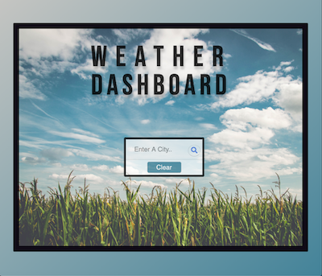
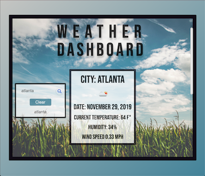
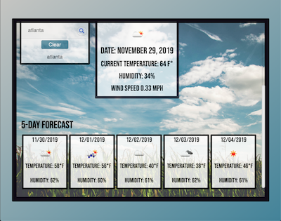

# Weather-Dashboard
A weather dashboard application with search functionality to find current weather conditions and the future weather outlook for multiple cities.

## Built With

* JavaScript/jQuery
* HTML/CSS
* Bootstrap
* Animate-CSS
* Google Fonts
* Weather-Now API
* Ajax

## Authors

* **Stephen Webb** - *Initial work* - [Weather DashBoard](https://stevie2codes.github.io/Weather-Dashboard/)

## What I learned

In this project we were introduced to API calls using AJAX. I had a lot of fun with this one. I really enjoy getting live data to use in projects that can be useful to a user. Ive learned how to read through API documentation to see how to implement said data and utilize javascript/jquery to place that data into the DOM. 
